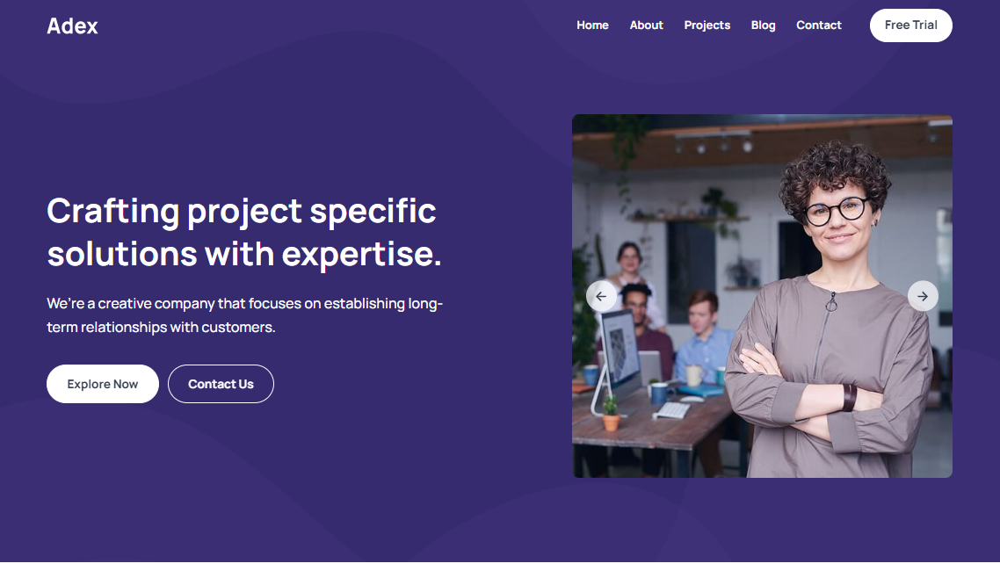

# 💼 Adex - Business Agency Website Template



<div align="center">

[](https://business-agency-template-aditya8raj.vercel.app/)
[](https://github.com/Aditya8Raj)
[](./LICENSE)

</div>

---

## 📋 Overview

**Adex** is a sleek and modern business agency website template. Built with HTML5, CSS3, and vanilla JavaScript, this template features a professional design with hero slider, service showcase, accordion about section, feature highlights, statistics display, project portfolio, and comprehensive company information perfect for business agencies, consulting firms, and corporate services.

### ✨ Key Features

- 💼 **Business Agency Focused** - Perfect for agencies & consultants
- 📱 **Fully Responsive** - Seamless experience on all devices
- 🎬 **Hero Slider** - 3 slides with navigation controls
- 🔧 **4 Services** - Icon-based service cards
- 📊 **Accordion FAQ** - 3 expandable items in about section
- 📈 **Statistics** - 4 impressive company stats
- 📂 **3 Projects** - Portfolio case studies
- 🔧 **Easy to Customize** - Clean, well-structured code

---

## 🛠️ Tech Stack

| Technology   | Purpose                                                  |
| ------------ | -------------------------------------------------------- |
| HTML5        | Semantic structure and markup                            |
| CSS3         | Modern styling, animations, transitions                  |
| JavaScript   | Interactive functionality, slider, accordion, navigation |
| Ionicons     | Icon library (v5.5.2)                                    |
| Google Fonts | Typography (Manrope)                                     |

---

## 📁 Project Structure

```
businessAgency/
│
├── index.html              # Main HTML file
├── favicon.svg             # Site favicon
├── README.md               # Documentation
│
├── assets/
│   ├── css/
│   │   └── style.css       # Main stylesheet
│   │
│   ├── js/
│   │   └── script.js       # JavaScript functionality
│   │
│   └── images/
│       ├── logo-light.svg
│       ├── logo-dark.svg
│       ├── hero-bg.jpg
│       ├── hero-slide-1.jpg to hero-slide-3.jpg
│       ├── about-banner.png
│       ├── feature-banner.png
│       ├── stats-bg.jpg
│       ├── blog-1.jpg to blog-3.jpg
│       └── (various decorative elements)
│
└── readme-images/
    └── hero.png            # README preview image
```

---

## 📄 License

This project is licensed under the **MIT License** - see the [LICENSE](LICENSE) file for details.

---

## 👨‍💻 Author

**ADITYA RAJ**

- Website: [adityaraj.vercel.app](https://adityaraj.vercel.app)
- GitHub: [@Aditya8Raj](https://github.com/Aditya8Raj)

---

<div align="center">
  
  ### ⭐ Star this repo if you find it useful!
  
  Made with ❤️ by [ADITYA RAJ](https://adityaraj.vercel.app)
  
  **[⬆ Back to Top](#-adex---business-agency-website-template)**
  
</div>
