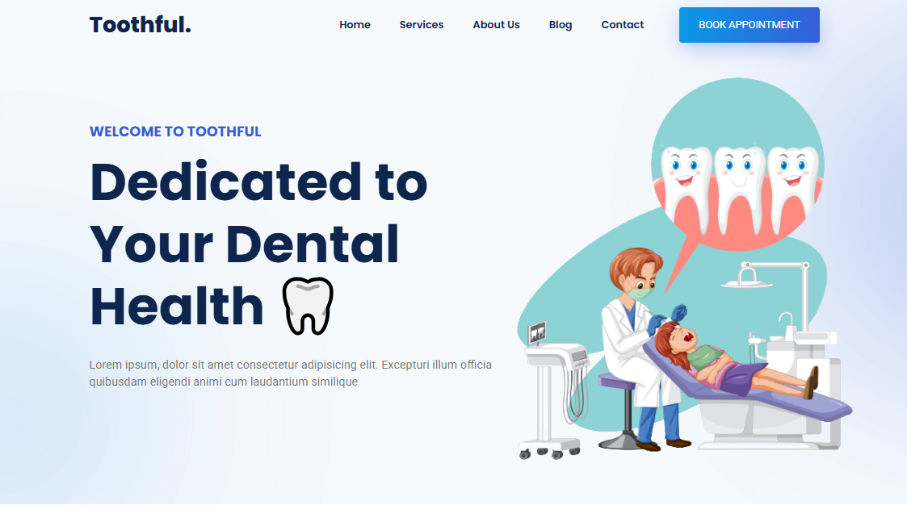

<div align="center">



# 🦷 Toothful - Dental Services Website Template

[](https://toothful-template-aditya8raj.vercel.app)
[](https://developer.mozilla.org/en-US/docs/Web/HTML)
[](https://developer.mozilla.org/en-US/docs/Web/CSS)
[](https://developer.mozilla.org/en-US/docs/Web/JavaScript)

**A modern, professional website template for dental clinics and healthcare services**

</div>

---

## 📋 Overview

**Toothful** is a clean and modern dental services website template designed for dental clinics, dentists, and healthcare professionals. Built with HTML5, CSS3, and vanilla JavaScript, this template features a professional layout with smooth animations and interactive elements powered by Lottie animations.

### ✨ Key Features

- 🦷 **Healthcare Focused** - Designed specifically for dental services
- 📱 **Fully Responsive** - Perfect viewing on all devices
- 🎨 **Modern UI/UX** - Clean, professional design
- 🎭 **Lottie Animations** - Engaging animated graphics
- ⚡ **Fast & Lightweight** - Optimized performance
- 🎯 **Easy to Customize** - Well-structured code

---

## 🛠️ Tech Stack

| Technology   | Purpose                      |
| ------------ | ---------------------------- |
| HTML5        | Semantic structure           |
| CSS3         | Styling and animations       |
| JavaScript   | Interactive functionality    |
| Lottie Files | Animated illustrations       |
| Ionicons     | Icon library                 |
| Google Fonts | Typography (Poppins, Roboto) |

---

## 📁 Project Structure

```
dentalServices/
│
├── index.html              # Main HTML file
├── tooth.svg               # Favicon
├── README.md               # Documentation
│
└── assets/
    ├── css/
    │   └── style.css       # Main stylesheet
    │
    ├── js/
    │   └── script.js       # JavaScript functionality
    │
    └── images/
        ├── hero-bg.png
        ├── dentist.png
        ├── about-banner.png
        ├── cta-banner.png
        ├── doctor-1.png
        ├── doctor-2.png
        ├── doctor-3.png
        ├── doctor-4.png
        ├── service-icon-1.png
        ├── service-icon-2.png
        ├── service-icon-3.png
        ├── service-icon-4.png
        ├── service-icon-5.png
        ├── service-icon-6.png
        ├── blog-1.jpg
        ├── blog-2.jpg
        └── blog-3.jpg
```

---

### Change Colors & Styling

Modify [assets/css/style.css](assets/css/style.css) to customize:

- Color scheme
- Fonts and typography
- Layout and spacing
- Button styles

---

## 📦 Dependencies

- [Lottie Player](https://lottiefiles.com/web-player) - For animated illustrations
- [Ionicons](https://ionic.io/ionicons) - Icon library
- [Google Fonts](https://fonts.google.com/) - Poppins & Roboto fonts

---

## 📄 License

This project is licensed under the **MIT License** - see the [LICENSE](LICENSE) file for details.

---

## 👨‍💻 Author

**ADITYA RAJ**

- Website: [adityaraj.vercel.app](https://adityaraj.vercel.app)
- GitHub: [@Aditya8Raj](https://github.com/aditya8raj)

---

<div align="center">
  
Made with ❤️ by [ADITYA RAJ](https://adityaraj.vercel.app)
  
**[⬆ Back to Top](#-toothful---dental-services-website-template)**
  
</div>
