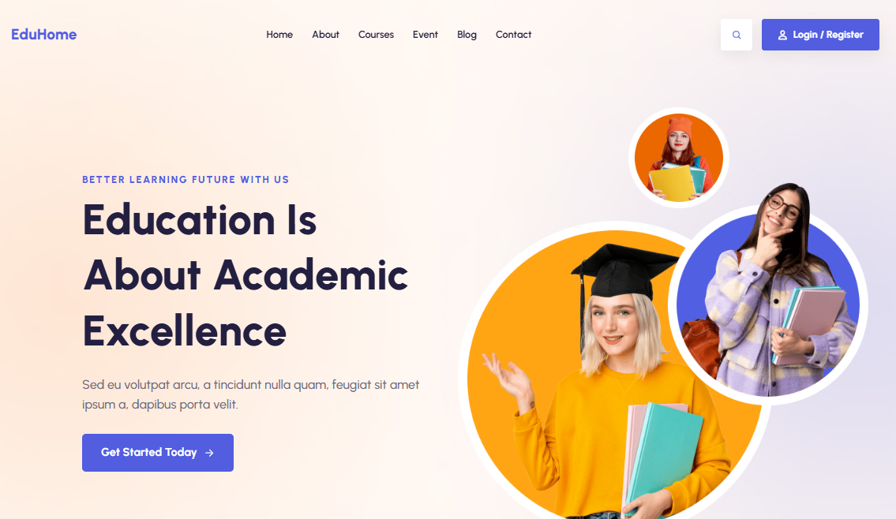

# 🎓 EduHome - Educational Website Template



<div align="center">

[](https://educational-template-aditya8raj.vercel.app/)
[](https://github.com/Aditya8Raj)
[](./LICENSE)

</div>

---

## 📋 Overview

**EduHome** is a modern and comprehensive educational website template. Built with HTML5, CSS3, and vanilla JavaScript, this template features an elegant design with search functionality, course categories, popular courses showcase, about section, workshop CTA, upcoming events, newsletter subscription, and complete educational platform information perfect for online learning platforms, educational institutions, and e-learning services.

### ✨ Key Features

- 🎓 **Education Focused** - Perfect for online courses & e-learning
- 📱 **Fully Responsive** - Seamless experience on all devices
- 🔍 **Search Functionality** - Full-screen search overlay
- 📚 **9 Course Categories** - Popular topics showcase
- 🎯 **6 Courses** - Detailed course cards with ratings
- 📅 **3 Events** - Upcoming event listings
- 📰 **Newsletter** - Subscription form with background
- 🔧 **Easy to Customize** - Clean, well-structured code

---

## 🛠️ Tech Stack

| Technology   | Purpose                                                         |
| ------------ | --------------------------------------------------------------- |
| HTML5        | Semantic structure and markup                                   |
| CSS3         | Modern styling, animations, transitions                         |
| JavaScript   | Interactive functionality, search overlay, navigation, wishlist |
| Ionicons     | Icon library (v5.5.2)                                           |
| Google Fonts | Typography (Urbanist)                                           |

---

## 📁 Project Structure

```
educational/
│
├── index.html              # Main HTML file
├── favicon.svg             # Site favicon
├── README.md               # Documentation
│
├── assets/
│   ├── css/
│   │   └── style.css       # Main stylesheet
│   │
│   ├── js/
│   │   └── script.js       # JavaScript functionality
│   │
│   └── images/
│       ├── hero-bg.jpg
│       ├── hero-banner.png
│       ├── hero-abs-1.png, hero-abs-2.png
│       ├── about-banner.jpg
│       ├── about-abs-1.jpg, about-abs-2.jpg
│       ├── about-icon-1.png to about-icon-3.png
│       ├── course-bg.jpg
│       ├── course-1.jpg to course-6.jpg
│       ├── cta-bg.png
│       ├── cta-banner.jpg
│       ├── event-1.jpg to event-3.jpg
│       ├── newsletter-bg.jpg
│       └── (various decorative elements)
│
└── readme-images/
    └── hero.png            # README preview image
```

---

## 📄 License

This project is licensed under the **MIT License** - see the [LICENSE](LICENSE) file for details.

---

## 👨‍💻 Author

**ADITYA RAJ**

- Website: [adityaraj.vercel.app](https://adityaraj.vercel.app)
- GitHub: [@Aditya8Raj](https://github.com/Aditya8Raj)

---

<div align="center">
  
  ### ⭐ Star this repo if you find it useful!
  
  Made with ❤️ by [ADITYA RAJ](https://adityaraj.vercel.app)
  
  **[⬆ Back to Top](#-eduhome---educational-website-template)**
  
</div>
