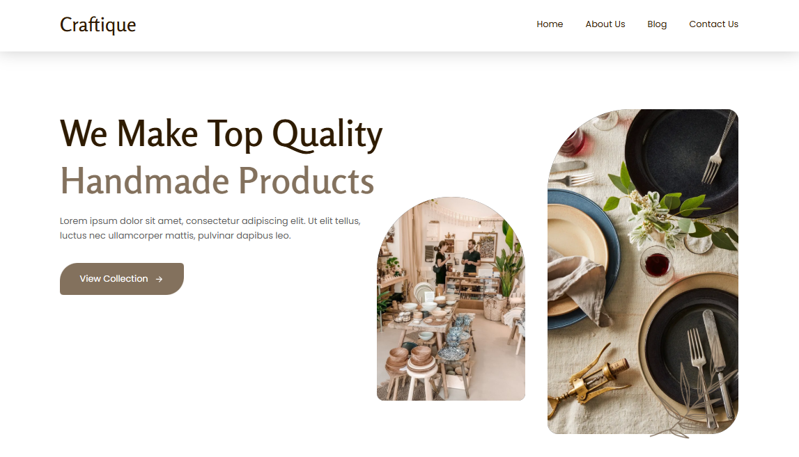

<div align="center">
  
  
  
  # 🎨 Craftique - Handmade Products Website Template
  
  [](https://handmadeproducts-template-aditya8raj.vercel.app/)
  
  
  
  
  **A beautiful, fully responsive website template for showcasing handmade products and crafts**
  
  [🌐 Live Demo](https://handmadeproducts-template-aditya8raj.vercel.app/) • [📝 Documentation](#features) • [🚀 Get Started](#quick-start)
  
</div>

---

## 📋 Table of Contents

- [Overview](#-overview)
- [Features](#-features)
- [Tech Stack](#-tech-stack)
- [Project Structure](#-project-structure)
- [Quick Start](#-quick-start)
- [Sections](#-sections)
- [Customization](#-customization)
- [Browser Support](#-browser-support)
- [Contributing](#-contributing)
- [License](#-license)
- [Author](#-author)

---

## 🎯 Overview

**Craftique** is a modern, elegant, and fully responsive website template designed specifically for artisans, craft makers, and handmade product businesses. Built with clean HTML, CSS, and vanilla JavaScript, this template offers a perfect starting point for showcasing your handcrafted products online.

### ✨ Highlights

- 📱 **Fully Responsive** - Looks perfect on all devices (desktop, tablet, mobile)
- 🎨 **Modern Design** - Clean and elegant user interface
- ⚡ **Fast Loading** - Optimized performance with minimal dependencies
- 🔧 **Easy to Customize** - Well-organized code structure
- 🎭 **Smooth Animations** - Subtle transitions and effects
- 🌐 **Cross-browser Compatible** - Works on all modern browsers

---

## 🚀 Features

### 🎪 Hero Section

- Eye-catching dual-banner layout
- Compelling call-to-action button
- Animated elements with decorative shapes

### 📖 About Section

- Multiple image layouts
- Company history and passion statement
- Professional storytelling structure

### 🛍️ Collection Showcase

- Three main product categories:
  - 🏺 Pottery & Ceramics
  - 👜 Leather Craft
  - 🏠 Home Decoration
- Individual gallery pages for each category
- Responsive grid layout

### ⭐ Features Section

- Video showcase with play button
- Three key features:
  - ✅ 100% Guarantee
  - 👥 Professional Staffs
  - 💰 Affordable Price
- Custom SVG icons

### 💬 Testimonials

- Customer testimonials section
- Founder's message display
- Elegant quote styling

### 🖼️ Gallery Section

- Four sub-categories:
  - Vases & Plant Pots
  - Clay Craft
  - Sculpturing
  - Accessories
- Hover effects and overlay transitions

### 📰 Blog & News

- Latest blog posts grid
- Article metadata (author, date, category)
- Thumbnail images for each post

### 🔗 Footer

- Social media links (Facebook, Twitter, Instagram, YouTube)
- Navigation links
- Support section
- Contact information
- Copyright notice

### 📱 Navigation

- Sticky header on scroll
- Mobile-friendly hamburger menu
- Smooth scrolling
- Overlay menu for small screens

---

## 🛠️ Tech Stack

| Technology                                                                                                 | Purpose                            |
| ---------------------------------------------------------------------------------------------------------- | ---------------------------------- |
|                   | Structure and semantic markup      |
|                      | Styling and responsive design      |
|    | Interactivity and dynamic behavior |
|  | Typography (Poppins, Rosario)      |
|             | Icon library                       |

---

## 📁 Project Structure

```
handmadeProducts/
│
├── index.html              # Main HTML file
├── README.md               # Documentation
├── favicon.svg             # Site favicon
│
├── assets/
│   ├── css/
│   │   └── style.css       # Main stylesheet (1051 lines)
│   │
│   ├── js/
│   │   └── script.js       # JavaScript functionality
│   │
│   └── images/
│       ├── hero-banner-1.png
│       ├── hero-banner-2.png
│       ├── hero-shape.png
│       ├── about-1.jpg
│       ├── about-2.jpg
│       ├── about-3.jpg
│       ├── collection-1.jpg
│       ├── collection-2.jpg
│       ├── collection-3.jpg
│       ├── feature-banner.jpg
│       ├── feature-icon-1.svg
│       ├── feature-icon-2.svg
│       ├── feature-icon-3.svg
│       ├── gallery-1.jpg
│       ├── gallery-2.jpg
│       ├── gallery-3.jpg
│       ├── gallery-4.jpg
│       ├── blog-1.jpg
│       ├── blog-2.jpg
│       ├── blog-3.jpg
│       ├── blog-4.jpg
│       ├── play.svg
│       └── quote.svg
│
└── readme-images/
    └── hero.png            # README preview image
```

---

## 🎨 Customization

### Colors

Edit the CSS custom properties in [assets/css/style.css](assets/css/style.css):

```css
:root {
  --cultured: hsla(0, 0%, 97%, 1);
  --french-bistre: hsla(31, 17%, 44%, 1);
  --jet: hsla(0, 0%, 20%, 1);
  --bistre: hsla(35, 100%, 9%, 1);
  --camel: hsla(30, 30%, 58%, 1);
  --umber: hsla(31, 17%, 36%, 1);
  --granite-gray: hsla(0, 0%, 38%, 1);
  --white: hsla(0, 0%, 100%, 1);
  --black: hsla(0, 0%, 0%, 1);
}
```

### Images

Replace images in the `assets/images/` directory with your own. Maintain the same filenames or update references in [index.html](index.html).

### Content

All content is in [index.html](index.html). Use Find & Replace to update:

- Company name: "Craftique"
- Tagline: "We Make Top Quality Handmade Products"
- Descriptions and text
- Navigation links
- Social media URLs

---

## 📄 License

This project is licensed under the **MIT License** - see the [LICENSE](LICENSE) file for details.

---

## 👨‍💻 Author

**ADITYA RAJ**

- Website: [adityaraj.vercel.app](https://adityaraj.vercel.app)
- GitHub: [@Aditya8Raj](https://github.com/aditya8Raj)

---

<div align="center">
  
  ### ⭐ Star this repo if you find it useful!
  
  Made with ❤️ by [ADITYA RAJ](https://adityaraj.vercel.app)
  
  **[⬆ Back to Top](#-craftique---handmade-products-website-template)**
  
</div>
