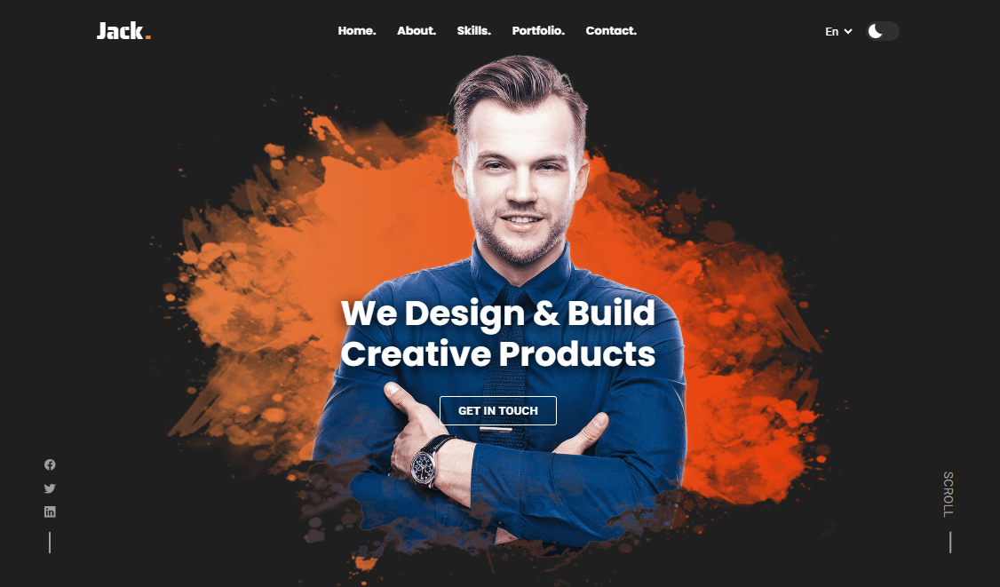

# 💼 Jack - Personal Portfolio Template



<div align="center">

[](https://personal-portfolio-template-aditya8raj.vercel.app/)
[](https://github.com/Aditya8Raj)
[](./LICENSE)

</div>

---

## 📋 Overview

**Jack** is a modern and stylish personal portfolio template. Built with HTML5, CSS3, and vanilla JavaScript, this template features a clean dark theme design with theme toggle, language selector, responsive navigation, stats showcase, skills/tools toggle, portfolio gallery, and comprehensive contact section perfect for developers, designers, and creative professionals.

### ✨ Key Features

- 👨‍💻 **Developer Portfolio** - Perfect for showcasing your work
- 📱 **Fully Responsive** - Seamless experience on all devices
- 🌓 **Theme Toggle** - Dark/Light mode switcher
- 🌐 **Language Selector** - Multi-language support (En/Ar)
- 📊 **Stats Cards** - Experience, projects, and clients showcase
- 🛠️ **Skills/Tools Toggle** - Interactive skills display with 12 skills + 12 tools
- 🎨 **Portfolio Gallery** - 7 project showcases with "Load more" button
- 📧 **Contact Form** - Complete contact section with form
- 🔧 **Easy to Customize** - Clean, well-structured code

---

## 🛠️ Tech Stack

| Technology   | Purpose                                                               |
| ------------ | --------------------------------------------------------------------- |
| HTML5        | Semantic structure and markup                                         |
| CSS3         | Modern styling, animations, theme toggle                              |
| JavaScript   | Theme switcher, navigation toggle, skills/tools toggle, smooth scroll |
| Ionicons     | Icon library (v5.5.2)                                                 |
| Google Fonts | Typography (Poppins, Roboto, Saira Stencil One)                       |

---

## 📁 Project Structure

```
personalPortfolio/
│
├── index.html              # Main HTML file
├── favicon.svg             # Site favicon
├── README.md               # Documentation
│
├── assets/
│   ├── css/
│   │   └── style.css       # Main stylesheet with dark/light theme
│   │
│   ├── js/
│   │   └── script.js       # JavaScript functionality (theme, navigation, toggle)
│   │
│   └── images/
│       ├── hero-banner.png (desktop)
│       ├── hero-banner-md.png (tablet)
│       ├── hero-banner-sm.png (mobile)
│       ├── about-banner.png
│       ├── stats-card_icon-1.png to stats-card_icon-3.png
│       ├── html5.png, css3.png, javascript.png, typescript.png
│       ├── jquery.png, bootstrap.png, angular.png, react.png, vue.png
│       ├── firebase.png, pugjs.png, sass.png
│       ├── ajax.png, gulp.png, webpack.png, git.png, npm.png
│       ├── command.png, vs-code.png, trello.png, clickup.png
│       ├── slack.png, photoshop.png, adobe-xd.png
│       ├── project-1.png to project-7.png
│       └── (various skill/tool logos)
│
└── readme-images/
    └── hero.png            # README preview image
```

---

## 📄 License

This project is licensed under the **MIT License** - see the [LICENSE](LICENSE) file for details.

---

## 👨‍💻 Author

**ADITYA RAJ**

- Website: [adityaraj.vercel.app](https://adityaraj.vercel.app)
- GitHub: [@Aditya8Raj](https://github.com/Aditya8Raj)

---

<div align="center">
  
  ### ⭐ Star this repo if you find it useful!
  
  Made with ❤️ by [ADITYA RAJ](https://adityaraj.vercel.app)
  
  **[⬆ Back to Top](#-jack---personal-portfolio-template)**
  
</div>
