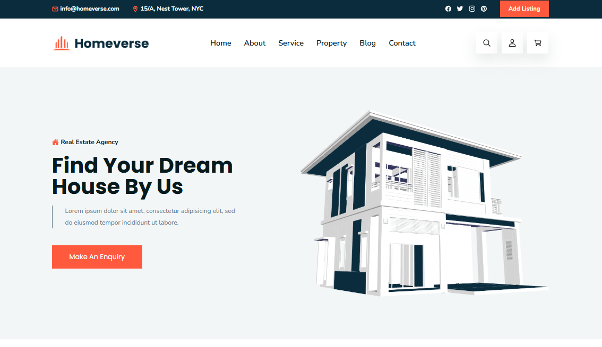

# 🏡 Homeverse - Real Estate Website Template



<div align="center">

[](https://real-estate-template-aditya8raj.vercel.app/)
[](https://github.com/Aditya8Raj)
[](./LICENSE)

</div>

---

## 📋 Overview

**Homeverse** is a modern and comprehensive real estate website template. Built with HTML5, CSS3, and vanilla JavaScript, this template features an elegant design with property listings, service showcase, amenities display, blog section, and complete property search functionality perfect for real estate agencies, property rental services, and real estate marketplaces.

### ✨ Key Features

- 🏡 **Real Estate Focused** - Perfect for property listings & rentals
- 📱 **Fully Responsive** - Seamless experience on all devices
- 🏘️ **Property Listings** - 4 featured properties with detailed info
- 🔍 **Advanced Filters** - Search, profile, cart functionality
- 🏢 **8 Amenities** - Showcase building facilities
- 📰 **Blog Section** - Latest news and updates
- 🔧 **Easy to Customize** - Clean, well-structured code

---

## 🛠️ Tech Stack

| Technology   | Purpose                                          |
| ------------ | ------------------------------------------------ |
| HTML5        | Semantic structure and markup                    |
| CSS3         | Modern styling, animations, grid/flex layouts    |
| JavaScript   | Interactive functionality, navigation, scrolling |
| Ionicons     | Icon library (v5.5.2)                            |
| Google Fonts | Typography (Nunito Sans, Poppins)                |

---

## 📁 Project Structure

```
realEstate/
│
├── index.html              # Main HTML file
├── favicon.svg             # Site favicon
├── README.md               # Documentation
│
├── assets/
│   ├── css/
│   │   └── style.css       # Main stylesheet
│   │
│   ├── js/
│   │   └── script.js       # JavaScript functionality
│   │
│   └── images/
│       ├── logo.png
│       ├── logo-light.png
│       ├── hero-banner.png
│       ├── about-banner-1.png
│       ├── about-banner-2.jpg
│       ├── service-1.png to service-3.png
│       ├── property-1.jpg to property-4.png
│       ├── author.jpg
│       ├── blog-1.png to blog-3.jpg
│       └── (various decorative elements)
│
└── readme-images/
    └── hero.png            # README preview image
```

---

## 📄 License

This project is licensed under the **MIT License** - see the [LICENSE](LICENSE) file for details.

---

## 👨‍💻 Author

**ADITYA RAJ**

- Website: [adityaraj.vercel.app](https://adityaraj.vercel.app)
- GitHub: [@Aditya8Raj](https://github.com/Aditya8Raj)

---

<div align="center">
  
  ### ⭐ Star this repo if you find it useful!
  
  Made with ❤️ by [ADITYA RAJ](https://adityaraj.vercel.app)
  
  **[⬆ Back to Top](#-homeverse---real-estate-website-template)**
  
</div>
