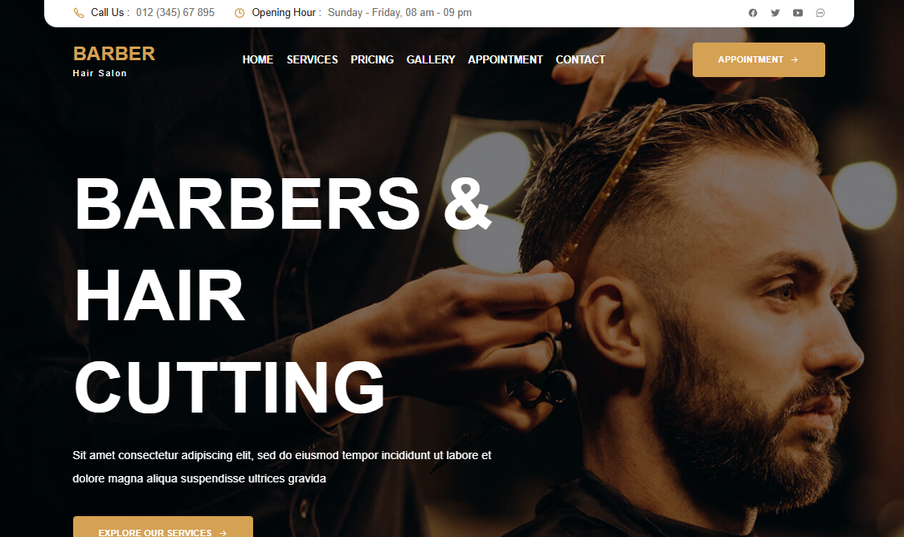

# ✂️ Barber - Hair Salon & Barber Shop Template



<div align="center">

[](https://salone-template-aditya8raj.vercel.app/)
[](https://github.com/Aditya8Raj)
[](./LICENSE)

</div>

---

## 📋 Overview

**Barber** is a professional and modern hair salon & barber shop website template. Built with HTML5, CSS3, and vanilla JavaScript, this template features a sleek design with smooth animations, filterable pricing plans, photo gallery, and appointment booking system perfect for barbershops, hair salons, and beauty parlors.

### ✨ Key Features

- ✂️ **Barber Focused** - Perfect for hair salons & barbershops
- 📱 **Fully Responsive** - Seamless experience on all devices
- 🔍 **Filterable Pricing** - 6 categories with 8 pricing plans
- 📸 **Photo Gallery** - Showcase your best work
- 📅 **Appointment System** - Complete booking form
- 🔧 **Easy to Customize** - Clean, well-structured code

---

## 🛠️ Tech Stack

| Technology   | Purpose                                             |
| ------------ | --------------------------------------------------- |
| HTML5        | Semantic structure and markup                       |
| CSS3         | Modern styling, animations, grid/flex layouts       |
| JavaScript   | Interactive functionality, filtering, form handling |
| Ionicons     | Icon library                                        |
| Flaticon     | Service icons                                       |
| Google Fonts | Typography (Oswald, Rubik)                          |

---

## 📁 Project Structure

```
salone/
│
├── index.html              # Main HTML file
├── favicon.svg             # Site favicon
├── README.md               # Documentation
│
├── assets/
│   ├── css/
│   │   ├── style.css       # Main stylesheet
│   │   └── flaticon.min.css # Flaticon styles
│   │
│   ├── js/
│   │   └── script.js       # JavaScript functionality
│   │
│   ├── fonts/
│   │   └── (flaticon fonts)
│   │
│   └── images/
│       ├── hero-banner.jpg
│       ├── pricing-bg.jpg
│       ├── pricing-1.jpg to pricing-8.jpg
│       ├── gallery-1.jpg to gallery-4.jpg
│       ├── appoin-banner-1.jpg, appoin-banner-2.jpg
│       ├── footer-bg.png
│       ├── footer-blog-1.jpg, footer-blog-2.jpg
│       └── (various icons and images)
│
└── readme-images/
    └── hero.png            # README preview image
```

---

## 📄 License

This project is licensed under the **MIT License** - see the [LICENSE](LICENSE) file for details.

---

## 👨‍💻 Author

**ADITYA RAJ**

- Website: [adityaraj.vercel.app](https://adityaraj.vercel.app)
- GitHub: [@aditya8raj](https://github.com/aditya8raj)

---

<div align="center">
  
  ### ⭐ Star this repo if you find it useful!
  
  Made with ❤️ by [ADITYA RAJ](https://adityaraj.vercel.app)
  
  **[⬆ Back to Top](#️-barber---hair-salon--barber-shop-template)**
  
</div>
