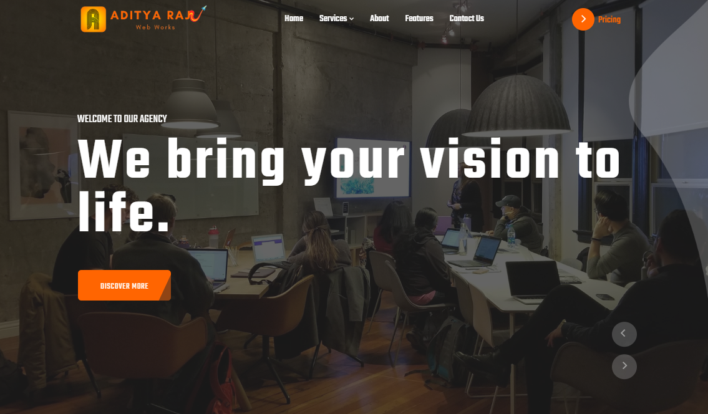

# 🚀 AR Web Works - Web Agency Website Template



<div align="center">

[](https://webagency-template-aditya8raj.vercel.app/)
[](https://github.com/Aditya8Raj)
[](./LICENSE)

</div>

---

## 📋 Overview

**AR Web Works** is a professional and modern web agency website template designed for digital agencies, creative studios, and web development companies. Built with HTML5, CSS3, Bootstrap, and jQuery, this template features stunning animations, portfolio showcases, and comprehensive service presentations.

### ✨ Key Features

- 🎨 **Professional Design** - Perfect for web agencies and creative studios
- 📱 **Fully Responsive** - Bootstrap-powered responsive layout
- 🎭 **Rich Animations** - WOW.js and AOS animations throughout
- 🖼️ **Portfolio Showcase** - MixItUp filterable portfolio gallery
- ⚡ **High Performance** - Optimized assets and code
- 🔧 **Easy to Customize** - Well-organized Bootstrap structure

---

## 🛠️ Tech Stack

| Technology        | Purpose                       |
| ----------------- | ----------------------------- |
| HTML5             | Semantic structure and markup |
| CSS3              | Modern styling and animations |
| Bootstrap 4       | Responsive framework          |
| JavaScript/jQuery | Interactive functionality     |
| Owl Carousel      | Carousel/slider functionality |
| WOW.js            | Scroll animations             |
| AOS               | Scroll-triggered animations   |
| MixItUp           | Portfolio filtering           |
| Magnific Popup    | Lightbox/popup functionality  |
| CounterUp.js      | Animated counters             |
| Font Awesome Pro  | Icon library                  |
| Google Fonts      | Typography (Rubik, Teko)      |

---

## 📁 Project Structure

```
webAgency/
│
├── index.html              # Main homepage
├── contact.html            # Contact page
├── service.html            # Services page
├── README.md               # Documentation
│
├── css/
│   ├── bootstrap.css       # Bootstrap framework
│   ├── animate.css         # Animation library
│   ├── owl.carousel.min.css
│   ├── owl.theme.default.min.css
│   ├── magnific-popup.css
│   └── custom.css          # Custom styles
│
├── js/
│   ├── jquery.min.js
│   ├── bootstrap.min.js
│   ├── popper.min.js
│   ├── font-awesome-pro.js
│   ├── wow.min.js
│   ├── mixitup.min.js
│   ├── jquery.magnific-popup.min.js
│   ├── jquery.counterup.min.js
│   ├── jquery.waypoints.min.js
│   ├── owl.carousel.min.js
│   └── custom.js           # Custom scripts
│
├── scss/                   # SASS source files
│
├── img/
│   ├── logo/
│   │   ├── nav-logo.png
│   │   └── favicon.png
│   ├── icon/
│   │   └── (various service icons)
│   ├── featured-image-1.jpg to featured-image-3.jpg
│   ├── portfolio-1.jpg to portfolio-6.jpg
│   ├── service01.jpg to service03.jpg
│   ├── samantha.jpg
│   └── (slider background images)
│
├── fonts/                  # Custom fonts
│
└── readme-images/
    └── hero.png            # README preview image
```

---

## 📄 License

This project is licensed under the **MIT License** - see the [LICENSE](LICENSE) file for details.

---

## 👨‍💻 Author

**ADITYA RAJ**

- Website: [adityaraj.vercel.app](https://adityaraj.vercel.app)
- GitHub: [@aditya8raj](https://github.com/aditya8raj)

---

<div align="center">
  
  ### ⭐ Star this repo if you find it useful!
  
  Made with ❤️ by [ADITYA RAJ](https://adityaraj.vercel.app)
  
  **[⬆ Back to Top](#-ar-web-works---web-agency-website-template)**
  
</div>
